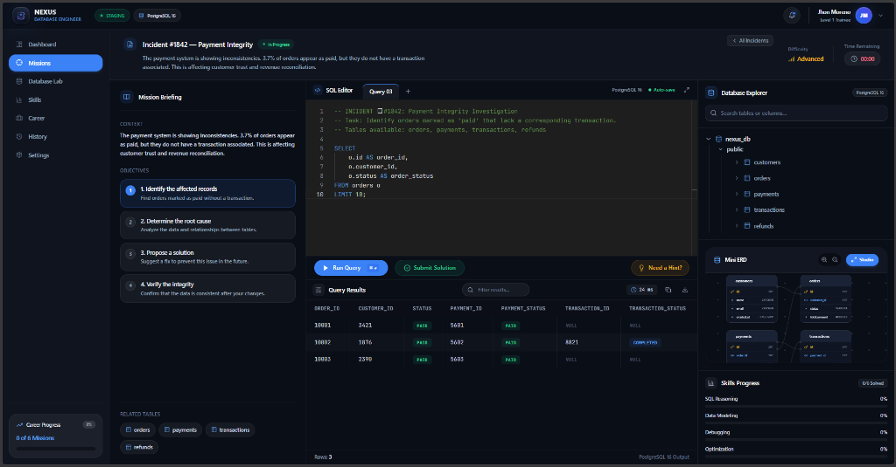

#  NEXUS — Database Engineering Simulator

<div align="center">

> **"Don't study SQL. Use it."**

[](https://nodejs.org)
[](https://www.typescriptlang.org)
[](https://react.dev)
[](https://vitejs.dev)
[](https://www.postgresql.org)
[](https://fastify.dev)
[](https://www.docker.com)
[](LICENSE)

<br/>

**Un simulador profesional donde el desarrollador aprende SQL, bases de datos y arquitectura resolviendo incidentes reales de producción.**

[Características](#-características-principales) •
[Arquitectura](#-arquitectura-del-sistema) •
[Niveles e Incidentes](#-catálogo-de-incidentes-jugables) •
[Instalación](#-guía-de-instalación-y-despliegue) •
[API Reference](#-referencia-de-la-api)

</div>

---

##  Vista Previa del Simulador



---

##  Filosofía y Visión del Proyecto

La mayoría de los cursos de SQL tradicionales son cuestionarios estáticos y teóricos de sintaxis básica. No preparan a los ingenieros para la realidad del desarrollo: **bloqueos por concurrencia (deadlocks), anomalías de integridad referencial, registros huérfanos, reconciliación contable y optimización de planes de ejecución**.

**NEXUS** cambia este paradigma convirtiendo el aprendizaje en una simulación de trabajo:
- **Entorno de Trabajo Real**: Un IDE completo con editor Monaco, pestañas múltiples, inspección de esquemas y árboles relacionales.
- **Motor PostgreSQL 16 Real**: Las consultas no se evalúan con expresiones regulares de texto; se ejecutan sobre un motor relacional en memoria (`pg-mem`) que valida tipos, índices, claves foráneas y devuelve errores de sintaxis genuinos.
- **Sin Respuestas Regaladas**: Los incidentes proporcionan consultas diagnósticas de investigación sin filtrar la solución.
- **Sistema de Pistas Gamificado**: Para desbloquear pistas arquitectónicas, el jugador debe demostrar su entendimiento aprobando un **Quiz Conceptual con opciones aleatorias** o ejecutando **Misiones Secundarias de Diagnóstico**.

---

##  Arquitectura del Sistema

El proyecto está diseñado como un monorepo modular de alta velocidad y baja fricción para desarrollo local y despliegue en contenedores:

```
                                  ┌─────────────────────────────────────────┐
                                  │               CLIENT LAYER              │
                                  │      React 18 + TypeScript + Vite       │
                                  │  Tailwind CSS + Lucide + Monaco Editor  │
                                  └────────────────────┬────────────────────┘
                                                       │ HTTPS / REST
                                                       ▼
                                  ┌─────────────────────────────────────────┐
                                  │            API GATEWAY LAYER            │
                                  │          Fastify Node.js Engine         │
                                  │     SQL Policy Validator & AST Check    │
                                  └──────────────┬──────────────────┬───────┘
                                                 │                  │
                        ┌────────────────────────▼──┐     ┌─────────▼──────────────────┐
                        │    POSTGRESQL SANDBOX     │     │   SOCRATIC EVALUATOR &     │
                        │    pg-mem Microkernel     │     │     PERSISTENT STORE       │
                        │ (Isolated Staging Ledgers)│     │  (Fisher-Yates Quiz Engine)│
                        └───────────────────────────┘     └────────────────────────────┘
```

### Componentes Clave:
1. **Frontend (`apps/web`)**:
   - Construido con **React 18**, **Vite** y **Tailwind CSS**.
   - Integra el editor de código **Monaco Editor** con atajos profesionales (`Ctrl + Enter` para ejecutar).
   - Diagrama de Relaciones Entidad-Relación (ERD) interactivo y explorador de esquema en tiempo real.
   - Sistema de alertas flotantes (**Toast Notifications**) para feedback visual inmediato.
2. **Backend API (`apps/api`)**:
   - Servidor HTTP ultrarrápido con **Fastify**.
   - Gateway de seguridad que intercepta queries destructivas (`DROP`, `ALTER`, inyecciones maliciosas) mediante análisis estático.
   - Instancias aisladas en memoria de **PostgreSQL 16** con esquemas precargados por incidente.
   - Persistencia de progreso en tiempo real (`user-progress.json`).

---

##  Catálogo de Incidentes Jugables

| Incidente | Título | Dominio | Dificultad | Habilidades Evaluadas |
| :--- | :--- | :--- | :---: | :--- |
| **#1021** | **Orphaned Customer Records** | E-Commerce / CRM | `Beginner` | `SELECT`, `WHERE`, `IS NULL`, Foreign Key Integrity |
| **#1140** | **Cart Abandonment Analytics** | E-Commerce / Growth | `Intermediate` | `GROUP BY`, `HAVING`, Agregaciones (`SUM`, `COUNT`) |
| **#1280** | **Currency Ledger Reconciliation**| Fintech / FX Trading | `Intermediate` | Composite Joins, Desviación de spreads matemáticos |
| **#1842** | **Payment Integrity** | Fintech / Payments | `Advanced` | Multi-hop `LEFT JOIN`, Anti-Join (`IS NULL`), Reconciliación |
| **#1930** | **High-Concurrency Inventory Deadlocks** | High-Scale Retail | `Advanced` | Row-level locking (`FOR UPDATE`), Orden determinista de SKUs |
| **#2045** | **Fraudulent Refund Velocity** | Cyber-Fraud Defense | `Expert` | Window Functions (`COUNT(*) OVER (PARTITION BY ...)`)|

---

##  Sistema de Ayudas Socráticas y Gamificación

Para garantizar que el aprendizaje sea significativo y no una simple copia de código:

### 1. Quizzes Conceptuales Aleatorizados (Fisher-Yates Shuffle)
- Cada incidente cuenta con preguntas de Opción Múltiple y Verdadero/Falso que evalúan el concepto detrás del problema (ej. *¿Por qué un INNER JOIN elimina registros con claves nulas?*).
- **En cada intento o reintento, las opciones y la posición de la respuesta correcta cambian de lugar aleatoriamente**, impidiendo la memorización por posición.

### 2. Misiones Secundarias (Side Quests)
- El jugador puede investigar tablas satélite mediante consultas de exploración guiadas para contrastar hipótesis antes de tocar la consulta principal.

### 3. Escalafón Profesional y XP
- Los usuarios ganan **+25 XP** por pistas aprobadas, **+50 XP** por objetivos intermedios y **+200 XP** al solucionar el incidente completo.
- El escalafón profesional asciende dinámicamente desde **Trainee Nivel 1** hasta **Principal Database Architect**.

---

##  Estructura del Monorepo

```bash
nexus/
├── apps/
│   ├── api/                     # Backend Fastify + Sandboxes PostgreSQL
│   │   ├── data/                # Almacén persistente de progreso (user-progress.json)
│   │   ├── src/
│   │   │   ├── data/            # Módulos de incidentes, schemas y quizzes
│   │   │   ├── gateway/         # Validador de políticas SQL y seguridad
│   │   │   ├── sandbox/         # Motor Postgres in-memory (pg-mem)
│   │   │   └── server.ts        # Endpoints REST y evaluador multinivel
│   │   └── package.json
│   │
│   └── web/                     # Frontend React + Vite
│       ├── src/
│       │   ├── components/      # UI, Navbar, Sidebar, Modals, Editor, Visualizador ERD
│       │   ├── types/           # Definiciones de TypeScript
│       │   ├── App.tsx          # Orquestador del simulador
│       │   └── main.tsx
│       ├── index.html
│       └── vite.config.ts
│
├── assets/                      # Capturas de pantalla e imágenes de arquitectura
├── docs/                        # Documentación técnica y especificaciones de diseño
├── docker-compose.yml           # Orquestación de contenedores
├── Dockerfile.api               # Imagen Docker para el backend
├── Dockerfile.web               # Imagen Docker para el frontend
└── package.json                 # Configuración de workspaces monorepo
```

---

##  Guía de Instalación y Despliegue

### Prerrequisitos
- [Node.js](https://nodejs.org/) v18.0.0 o superior.
- Gestor de paquetes `npm` (incluido con Node.js) o `pnpm`.
- *(Opcional)* [Docker](https://www.docker.com/) y Docker Compose.

---

### Opción 1: Ejecución Local (Recomendada para Desarrollo)

1. **Clonar el repositorio:**
   ```bash
   git clone https://github.com/Jhonmoreno000/nexus.git
   cd nexus
   ```

2. **Instalar dependencias:**
   ```bash
   npm install
   ```

3. **Compilar los proyectos:**
   ```bash
   npm run build --prefix apps/api
   npm run build --prefix apps/web
   ```

4. **Iniciar los servidores:**
   - **Terminal 1 — Servidor API (Puerto 3001):**
     ```bash
     cd apps/api
     node dist/server.js
     ```
   - **Terminal 2 — Aplicación Web (Puerto 3000):**
     ```bash
     cd apps/web
     npm run dev
     ```

5. **Abrir en tu navegador:**
   - Frontend: [http://localhost:3000](http://localhost:3000)
   - Healthcheck API: [http://localhost:3001/api/health](http://localhost:3001/api/health)

---

### Opción 2: Despliegue con Docker Compose

Si prefieres ejecutar todo encapsulado en contenedores sin configurar dependencias locales:

```bash
docker-compose up --build
```

Ambos servicios se iniciarán automáticamente:
- **Web**: `http://localhost:3000`
- **API**: `http://localhost:3001`

---

##  Referencia de la API

| Método | Endpoint | Descripción |
| :--- | :--- | :--- |
| `GET` | `/api/health` | Estado del motor PostgreSQL 16 y salud del microservicio |
| `GET` | `/api/user/profile` | Obtiene el perfil real persistente del usuario (XP, nivel, historial) |
| `POST`| `/api/user/reset` | Reinicia las estadísticas y objetivos a cero |
| `POST`| `/api/user/unlock-hint` | Valida y desbloquea una pista tras aprobar un quiz o side quest |
| `GET` | `/api/missions` | Lista los 6 incidentes disponibles y su estado de resolución |
| `GET` | `/api/missions/:id` | Retorna el briefing, esquema relacional, preguntas y side quests del incidente |
| `POST`| `/api/missions/:id/execute` | Ejecuta una consulta SQL en el sandbox aislado de PostgreSQL |
| `POST`| `/api/missions/:id/evaluate` | Evalúa la solución contra las suites de aserción y registra el éxito |

---

##  Perfil y Créditos

- **Proyecto**: NEXUS — Database Engineering Simulator
- **Autor / Ingeniero**: Jhon Moreno ([@Jhonmoreno000](https://github.com/Jhonmoreno000))

<div align="center">
  <sub>Construido con pasión por la ingeniería de bases de datos. <b>Don't study SQL. Use it.</b></sub>
</div>
